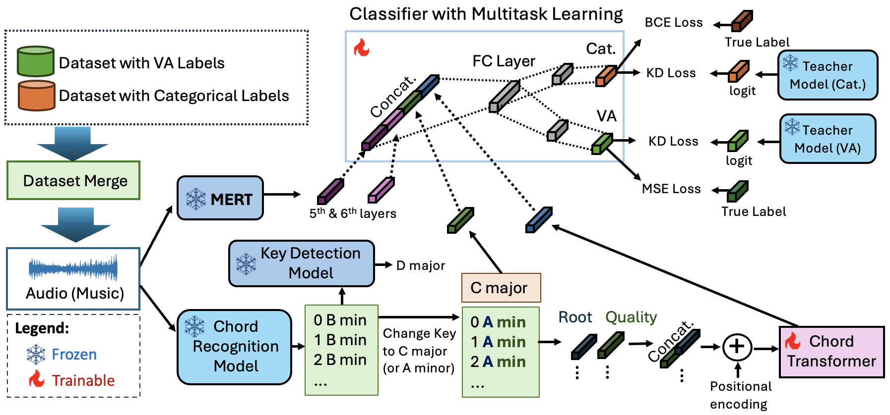

<div align="center">

# Music2Emo: Towards Unified Music Emotion Recognition across Dimensional and Categorical Models

</div>

This repository contains the code accompanying the paper "Towards Unified Music Emotion Recognition across Dimensional and Categorical Models"


<div align="center">
  
</div>

## Introduction

We present a unified multitask learning framework for Music Emotion Recognition (MER) that integrates categorical and dimensional emotion labels, enabling training across multiple datasets. Our approach combines musical features (key and chords) with MERT embeddings and employs knowledge distillation to enhance generalization. Evaluated on MTG-Jamendo, DEAM, PMEmo, and EmoMusic, our model outperforms state-of-the-art methods, including the best-performing model from the MediaEval 2021 competition.




## Quickstart Guide


Predict emotion from audio:

```python
from music2emo import Music2emo

input_audio = "inference/input/test.mp3"

music2emo = Music2emo()
output_dic = music2emo.predict(input_audio)

valence = output_dic["valence"]
arousal = output_dic["arousal"]
predicted_moods =output_dic["predicted_moods"]

print("\n🎵 **Music Emotion Recognition Results** 🎵")
print("-" * 50)
print(f"🎭 **Predicted Mood Tags:** {', '.join(predicted_moods) if predicted_moods else 'None'}")
print(f"💖 **Valence:** {valence:.2f} (Scale: 1-9)")
print(f"⚡ **Arousal:** {arousal:.2f} (Scale: 1-9)")
print("-" * 50)

```

## Installation
This repo is developed using python version 3.10

```bash
git clone https://github.com/AMAAI-Lab/Music2Emotion
cd Music2Emotion
pip install -r requirements.txt
```

* Our code is built on pytorch version 2.3.1 (torch==2.3.1 in the requirements.txt). But you might need to choose the correct version of `torch` based on your CUDA version

## Dataset

Download the following datasets:
- MTG-Jamendo [(Link)](https://github.com/MTG/mtg-jamendo-dataset)
- PMEmo [(Link)](https://drive.google.com/drive/folders/1qDk6hZDGVlVXgckjLq9LvXLZ9EgK9gw0)
- DEAM [(Link)](https://cvml.unige.ch/databases/DEAM/)
- EmoMusic [(Link)](https://cvml.unige.ch/databases/emoMusic/)

After downloading, place all .mp3 files into the following directory structure:

```
dataset/
├── jamendo/
│   └── mp3/**/*.mp3    # MTG-Jamendo audio files (nested structure)
├── pmemo/
│   └── mp3/*.mp3       # PMEmo audio files
├── deam/
│   └── mp3/*.mp3       # DEAM audio files
└── emomusic/
    └── mp3/*.mp3       # EmoMusic audio files
```

## Directory Structure

* `config/`: Configuration files
* `dataset/`: Dataset directories
* `dataset_loader/`: Dataset loading utilities
* `utils/`: Other utilities
* `model/`
  * `linear.py`: Fully connected (FC) layer with MERT features
  * `linear_attn_ck.py`: FC layer with MERT and musical features (chord/key)
  * `linear_mt_attn_ck.py`: Multitask FC layer with MERT and musical features (chord/key)
* `preprocess/`
  * `feature_extractor.py`: MERT feature extraction
* `saved_models/`: Saved model weight files
* `data_loader.py`: Data loading script
* `train.py`: Training script
* `test.py`: Testing script
* `trainer.py`: Training pipeline script
* `inference.py`: Inference script
* `music2emo.py`: Video2Music module that outputs emotion from input audio
* `demo.ipynb`: Jupyter notebook for Quickstart Guide

## Training

```shell
  python train.py
```

## Test

```shell
  python test.py
```

## Evaluation

### Comparison of performance metrics when training on multiple datasets.

| **Training datasets**      | **MTG-Jamendo (J.)** | **DEAM (D.)**  | **EmoMusic (E.)** | **PMEmo (P.)**  |
|---------------------------|:-------------------:|:--------------:|:-----------------:|:---------------:|
|                           | PR-AUC / ROC-AUC   | R² V / R² A    | R² V / R² A       | R² V / R² A     |
| **Single dataset (X)**    | 0.1521 / 0.7806    | 0.5131 / 0.6025| 0.5957 / 0.7489   | 0.5360 / 0.7772 |
| **J + D**                 | 0.1526 / 0.7806    | 0.5144 / 0.6046| -                 | -               |
| **J + E**                 | 0.1540 / 0.7809    | -              | 0.6091 / 0.7525   | -               |
| **J + P**                 | 0.1522 / 0.7806    | -              | -                 | 0.5401 / 0.7780 |
| **J + D + E + P**         | **0.1543 / 0.7810** | **0.5184 / 0.6228** | **0.6512 / 0.7616** | **0.5473 / 0.7940** |


### Comparison of our proposed model with existing models on MTG-Jamendo dataset.

| **Model** | **PR-AUC** ↑ | **ROC-AUC** ↑ |
|--------------------|:-----------:|:----------:|
| lileonardo | 0.1508 | 0.7747 |
| SELAB-HCMUS | 0.1435 | 0.7599 |
| Mirable | 0.1356 | 0.7687 |
| UIBK-DBIS | 0.1087 | 0.7046 |
| Hasumi et al. | 0.0730 | 0.7750 |
| Greer et al. | 0.1082 | 0.7354 |
| MERT-95M | 0.1340 | 0.7640 |
| MERT-330M | 0.1400 | 0.7650 |
| **Proposed (Ours)** | **0.1543** | **0.7810** |

